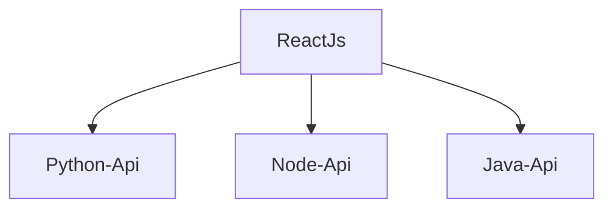

# monorepo-demo-gamesboards
If you ever wonder how a monorepo works. Check this one that has 4 applications in 4 differents programming languages: React javascript, Node.js Typescript, Python and Java. 

 The Frontend, in [React](./reactjs-boardgames/README.md), displays a list of boardgames, these boardgames are provided by 3 rest api in Python, Node.js and Java.
    - [React Javascript App](./reactjs-boardgames/README.md) 
    - [Node.js Typscript API](./nodejs-boardgames-api/README.md)
    - [Python Flask API](./python-boardgames-api/README.md) 
    - [Java Spring API](./java-boardgames-api/README.md) 

Each application has it own github worklows in the .github/workflows folder in the root of the main folder

# What this monorepo demonstrate?
- How to build some simple web application in Python, Java, Node and Reactjs
- How to setup unit tests and builds
- How to setup e2e test with Playwright and Node
- How to setup gihub actions ci pipeline

# how to run the applications localy
Check the documentation in each application folder to install and start each one. Starting by the React Application, then every api services in any orders. The React application will work even the api services are not running

# how to install and unit test it all
Use the python 3 script test_all.py at the root of the folder, it will install and unit test all the services of the monorepo. This will not run the services. This script is also run by github workflows. It looks a duplication of the unit testing of all the projects, but that is the best way to ensure this script always works.

> python3 test_all.py

# how to run end 2 end tests with playwright
Check out the [React App](./reactjs-boardgames/README.md) to see how to run them locally

