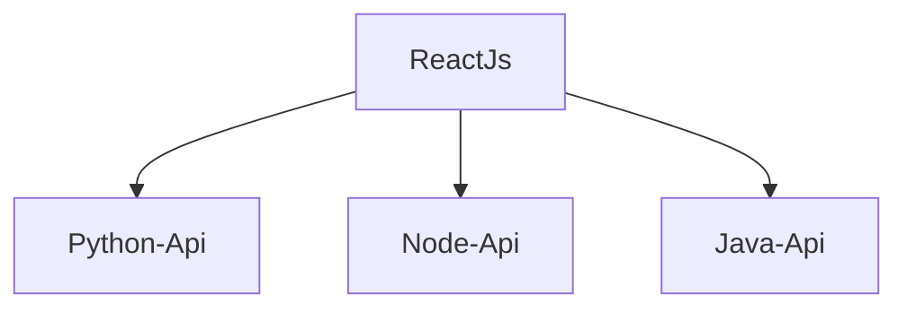
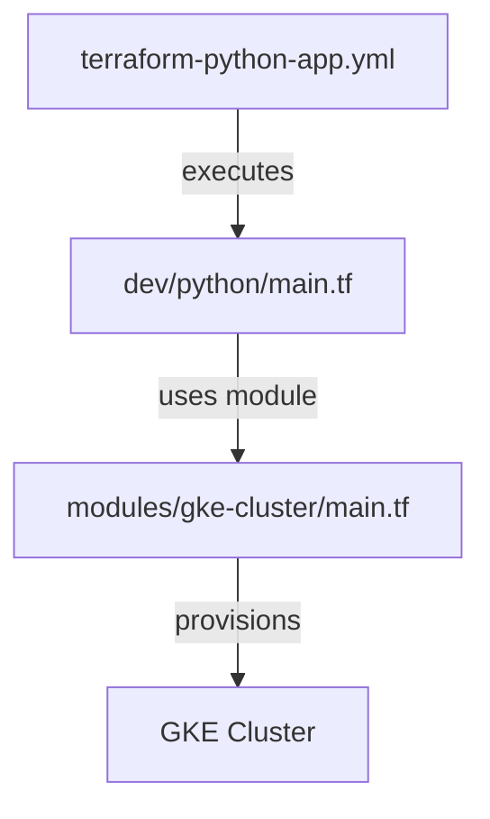
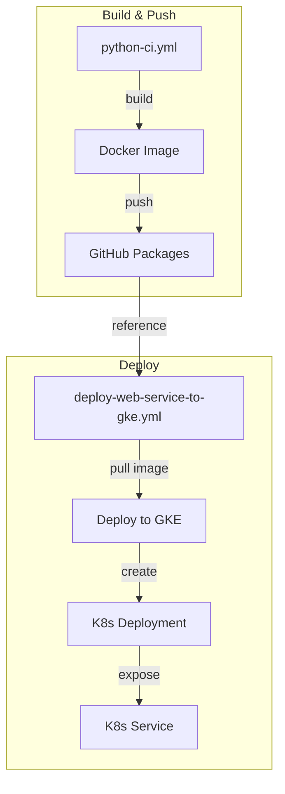

# monorepo-demo-gamesboards
If you ever wonder how a monorepo works. Check this one that has 4 applications in 4 differents programming languages: React javascript, Node.js Typescript, Python and Java, deployed on Google Cloud Platform with Github Action workflow, Terraform and Kubernetes (GKE).

 The Frontend, in [React](./reactjs-boardgames/README.md), displays a list of boardgames, these boardgames are provided by 3 rest api in Python, Node.js and Java.
    - [React Javascript App](./reactjs-boardgames/README.md) 
    - [Node.js Typscript API](./nodejs-boardgames-api/README.md)
    - [Python Flask API](./python-boardgames-api/README.md) 
    - [Java Spring API](./java-boardgames-api/README.md) 

Each application has it own github worklows in the .github/workflows folder in the root of the main folder

# What this monorepo demonstrates?
- How to build some simple web application in Python, Java, Node and Reactjs
- How to setup unit tests and builds
- How to setup e2e test with Playwright and Node
- How to setup gihub actions ci pipeline

# how to run the applications localy
Check the documentation in each application folder to install and start each one. Starting by the React Application, then every api services in any orders. The React application will work even the api services are not running

# how to install and unit test it all
Use the python 3 script test_all.py at the root of the folder, it will install and unit test all the services of the monorepo. This will not run the services. This script is also run by github workflows. It looks a duplication of the unit testing of all the projects, but that is the best way to ensure this script always works.

> python3 test_all.py

# how to run end 2 end tests with playwright
Check out the [React App](./reactjs-boardgames/README.md) to see how to run them locally

# Deployment to Google Kubernetes Engine (GKE) with Github Workflow
The backend services (Java app, Python app and Node app) are each one deploye on GKE in their own Kubernetes Cluster. Let's take the case of the Python app to see how this works

The building and deployment of the python app uses this files
- [terraform-python-app.yml](./.github/workflows/terraform-python-app.yml) : The terraform file that provision the GKE Cluster and the K8s deployment and service for the Python app
- [python-app-deploy.yml](./.github/workflows/python-app-deploy.yml) : The github workflow that runs the terraform to create the GKE Cluster and deploy the Python app
- [k8s/test/python-boardgames-api.yml](./k8s/test/python-boardgames-api.yml) : The kubernetes deployment and service file for the Python app. (Manifest file)  
- [terraform/envs/dev/python/main.tf](./terraform/envs/dev/python/main.tf) : The terraform file that creates the GKE Cluster and the K8s deployment and service for the Python app
- [terraform/modules/gke-cluster/main.tf](./terraform/modules/gke-cluster/main.tf) : The terraform file that creates the GKE Cluster for any app
- [david-gimelle/lab/.github/workflows/deploy-web-service-to-gke.yml@main](./david-gimelle/lab/.github/workflows/deploy-web-service-to-gke.yml@main) : The Reusable github workflow that runs the terraform to create the GKE Cluster and deploy the Python app

In short the python app is build as a docker image, this image is pushed to github packages, then this image is deployed on the GKE cluster. The GKE cluster is created by a separete github workflow using terraform and kubernetes manifest file.

Provisioning of the cluster with github action and terraform:

Deployment of the python app with github action to GKE cluster:

